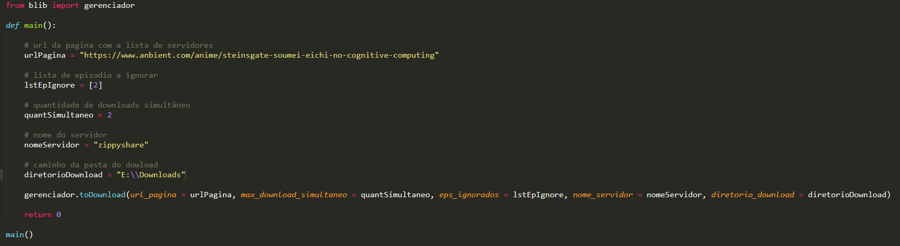
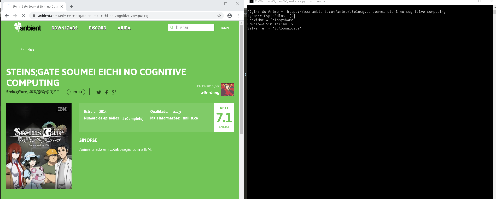
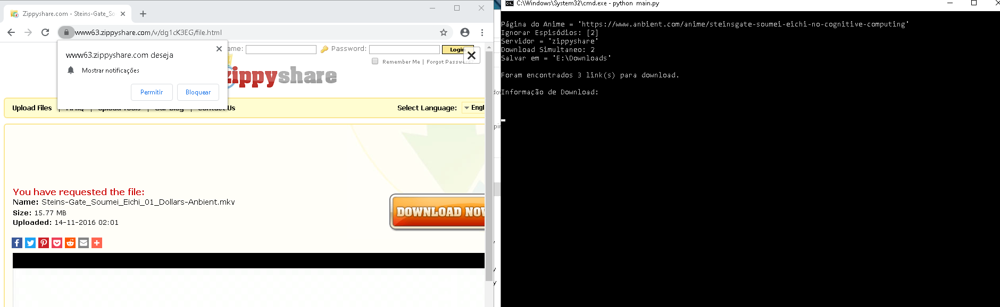
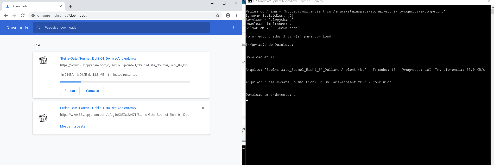
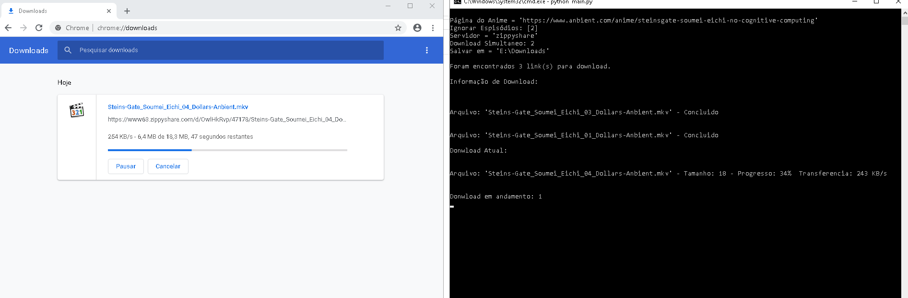

# automatizacao_download_selenium
Automatização de download com o Selenium Web Driver

O objetivo é o donwload automático dos episódios de anime com apenas um URL do [site](https://www.anbient.com "Anbient") de animes.

# Dependência 

- fake-useragent==0.1.11
- selenium==3.141.0
- urllib3==1.25.7
- chromedriver

Obs.:  
É necessário ter o navegador Google Chrome instalado. 
Download do chromedriver [aqui](exemplo/img0.png). 

#  Exemplo

- **Configuração do programa**
  

  
- **O programa acessando a página de anime**
  

  
- **O programa acessando a página de download**
  

  
- **O programa baixando o anime**
   

  

  
 Obs.: Para ver o pdf da página usada click [aqui](exemplo/pagina-anbient-site.pdf). .
